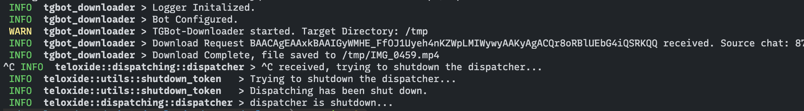

# TGBot-Downloader

A telegram bot that download video to local directory built with teloxide

Just send or forward a video to bot and it will be saved to configured directory

```
tgbot-downloader 

USAGE:
    tgbot-downloader [OPTIONS] --token <TOKEN>

OPTIONS:
    -a, --allowed-user <ALLOWED_USER>

    -h, --help
            Print help information

    -l, --loglevel <LOGLEVEL>
            Loglevel: debug, info, warn, error, default = info [default: info]

    -p, --path <PATH>
            [default: ./]

    -t, --token <TOKEN>
```

